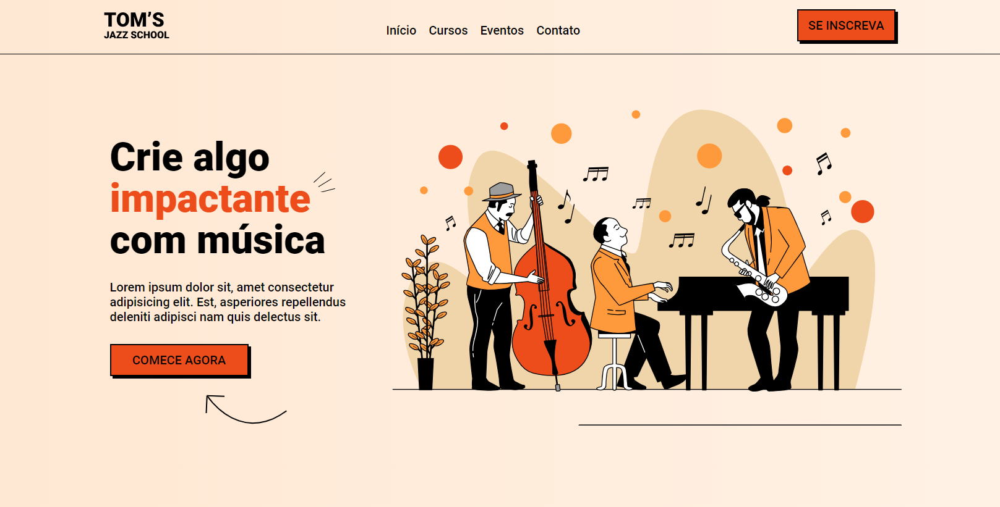

# Projeto Landing Page Música

Projeto de desenvolvimento em HTML e CSS com a Onebitecode.

  <a href="#-tecnologias">Tecnologias</a>&nbsp;&nbsp;&nbsp;|&nbsp;&nbsp;&nbsp;  
  <a href="#-projeto">Projeto</a>&nbsp;&nbsp;&nbsp;|&nbsp;&nbsp;&nbsp;  
  <a href="#-info">Informação</a>&nbsp;&nbsp;&nbsp;&nbsp;&nbsp;&nbsp;

 

## 🚀 Tecnologias

Esse projeto foi desenvolvido com as seguintes tecnologias:

- HTML
- CSS
- Git e Github

 

## 💻 Projeto

Projeto realizado com a Onebitecode, criando uma landing page de uma escola de música. É uma página responsive, sendo possível aceessar por celulares, tablets e desktop.

 

## 📁 Acesso ao projeto

É possível acessar o projeto através do [Link](https://github.com/Thamyresmya/Landing-page-Jazz)

 

## 🛠️ Landing Page

Veja como ficou o projeto [Landing Page](https://thamyresmya.github.io/Landing-page-Jazz/#)

 

Me siga nas redes sociais:
- [Linkedin](https://www.linkedin.com/in/thamyrescavalcante/)
- [Instagran](https://www.instagram.com/thamyres__cavalcante/)

 

---

Feito com ♥ by Thamyres Cavalcante.

